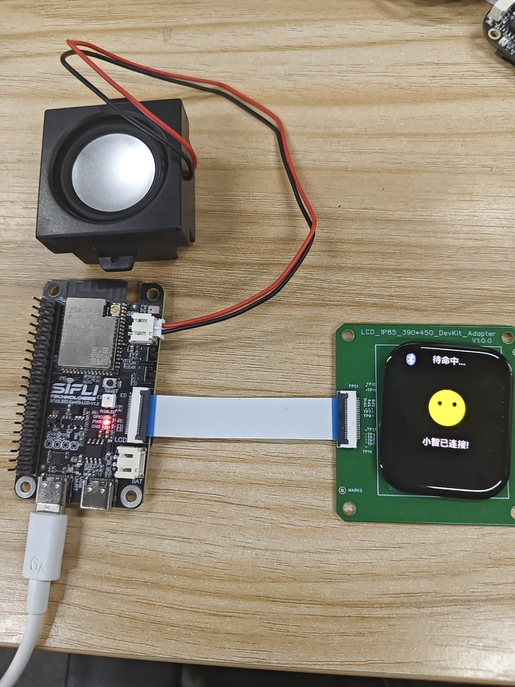

# 1\.上手指南

[Trace]: https://webfile.lovemcu.cn/file/sdk/SifliTrace_v2.2.6.7z
[52DevKit]: https://wiki.sifli.com/board/index.html
[SF32LB52x-DevKit-LCD固件文件]: https://github.com/78/xiaozhi-sf32/releases/tag/v1.0.0
[sftool]: https://github.com/OpenSiFli/sftool/releases/tag/0.1.5
[env_tool]: https://github.com/OpenSiFli/sftool/releases/tag/0.1.5
[小智源码]: https://github.com/78/xiaozhi-sf32

## 准备工作

### 硬件

- 一款开发板，例如[sf32lb52-devkit-lcd][52DevKit]
- 一个AMOLED屏幕
- 一个喇叭
- 开发板与屏幕连接线
- 一条USB Type-C数据线，连接开发板与电脑，注意不能是只有充电功能的Type-C线，插入开发板的USB-to-UART接口（注意不要插入专用USB功能接口）
- 电脑（Windows、Linux 或 macOS）

### 软件

如需在 [SF32LB52x-DevKit-LCD开发板] 上使用 AI小智，请安装以下软件：
- 固件文件：[SF32LB52x-DevKit-LCD开发板][SF32LB52x-DevKit-LCD固件文件]（可直接烧录使用，想编译烧录可参考对应章节介绍）
- 烧录工具：[SF32LB52x-DevKit-LCD开发板][sftool]，此烧录工具支持Windows、Linux 和 macOS 操作系统，请选择您的操作系统对应的版本，配套烧录固件使用。
- 串口调试工具：[串口工具][Trace]，异常情况可用于串口调试。
- 项目源码：[xiaozhi-sf32][小智源码](自编译，个性化修改推荐下载)
- 编译工具：[env][env_tool]，配套项目源码使用

