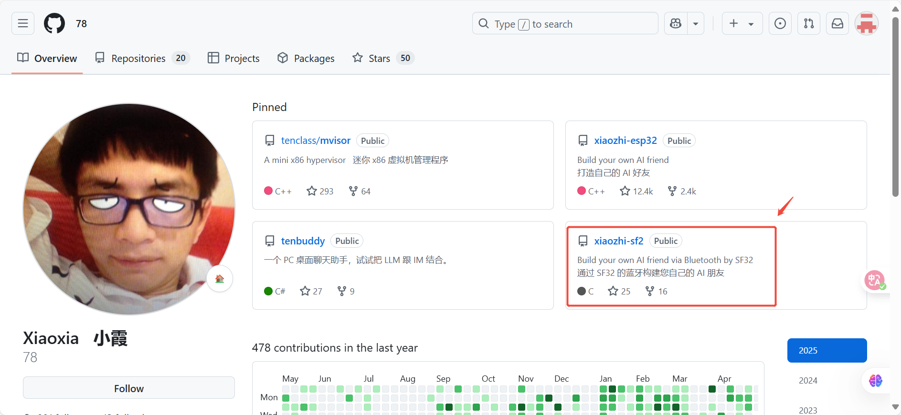
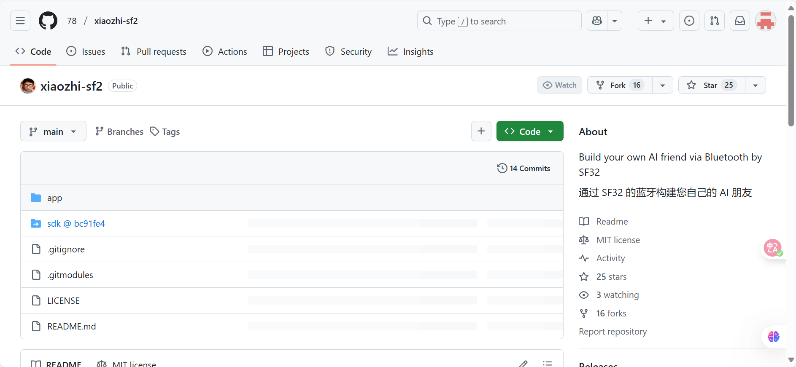

# SF32LB52-nano开发板
[xiaozhi-sf32]: https://github.com/78/xiaozhi-sf32
小智 AI 是 虾哥 制作并开源的一个 硬件 AI 聊天机器人 。它搭载上了近期热门的 AI 大模型，具有超越传统语音助手的智能水平。小智 AI 能够准确理解用户的意图，实现多语种实时翻译、情感化语音交流，并能主动思考，提供更加智能的服务。



***
现版本是SF32LB52芯片开发，通过蓝牙-pan协议共享手机网络，实现网络连接，进而连接AI模型，实现与小智面对面语音交互。现已开源至github:[xiaozhi-sf32]，欢迎大家使用。



```{toctree}
get-started
build_bin
build
xiaozhi_use
arch
```
