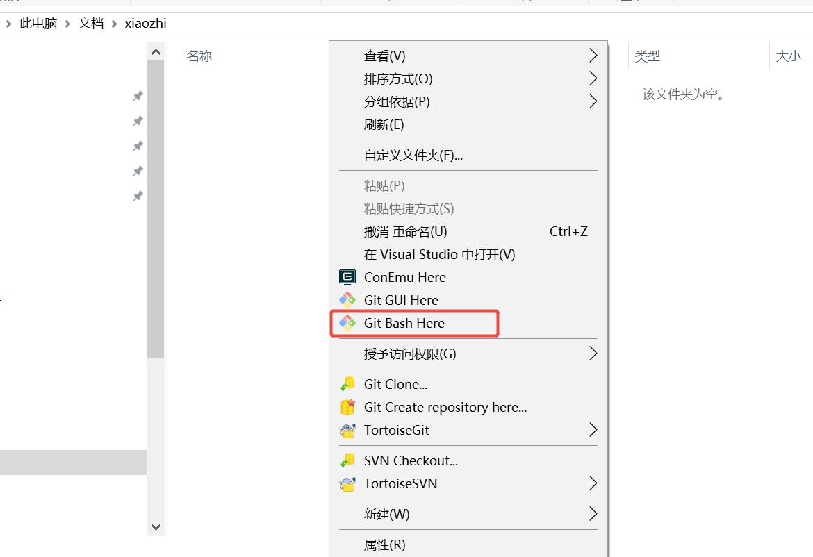
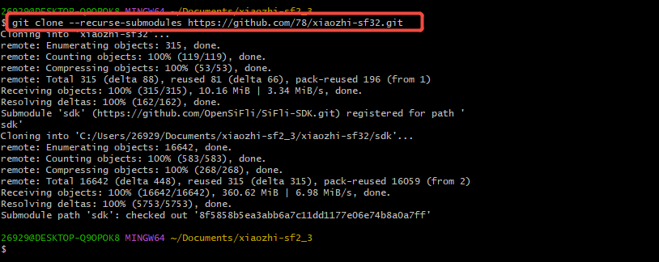
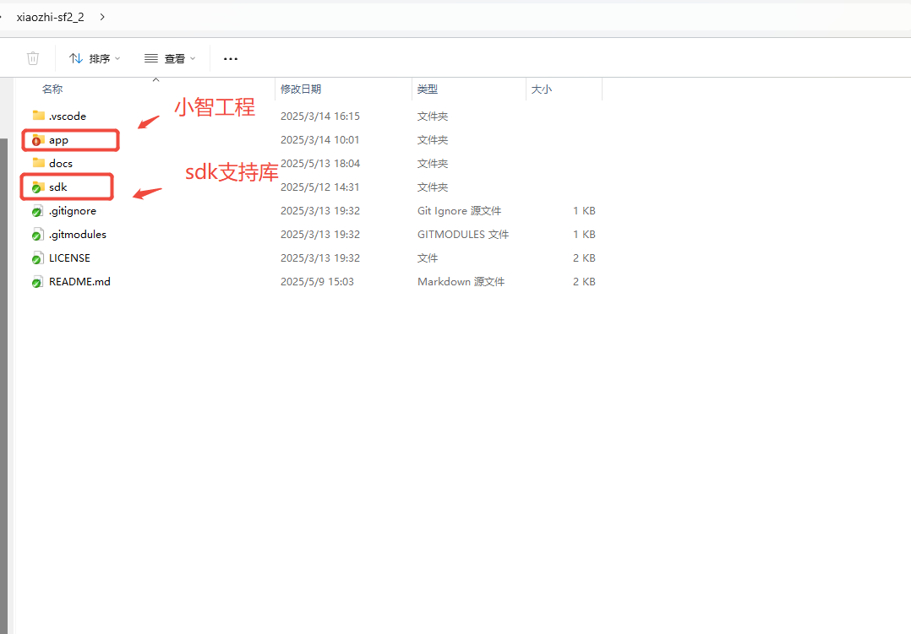
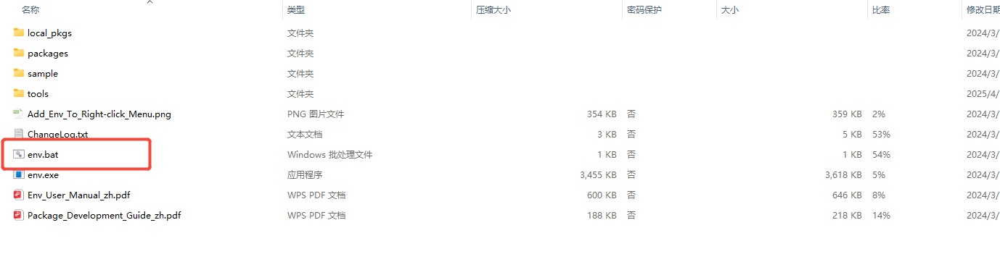
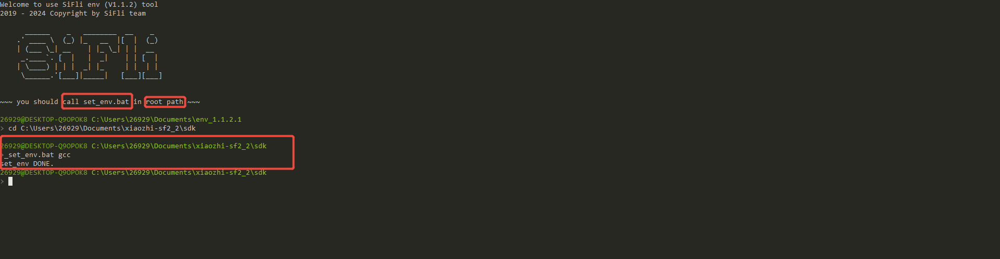
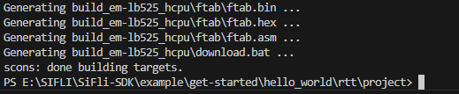

[env_tool]: https://github.com/OpenSiFli/sftool/releases/tag/0.1.5
[Supported_boards]: https://docs.sifli.com/projects/sdk/latest/sf32lb52x/supported_boards/index.html
[Git]: https://registry.npmmirror.com/binary.html?path=git-for-windows

# 3\.编译下载
## 获取项目工程
1.安装Git选择你想要的版本下载，下载地址：[国内下载链接][Git]，安装成功够在文件夹空白出下右键出现Git Bash 图标如下图1

2.创建一个存放项目的文件夹，并进入该文件夹，右键打开Git Bash终端
运行以下命令：`git clone --recurse-submodules https://github.com/78/xiaozhi-sf32.git`(复制命令后，在终端窗口中按鼠标右键选择Paste粘贴)


- Git Bash安装成功

- 终端窗口输入拉取命令

- 拉取后目录如图所示


## 编译工具
编译工具使用的是上手指南章节中软件准备的[env][env_tool]工具，此工具可配置编译环境，编译工程。


## 编译工程


1.下载[env][env_tool]工具，解压到任意目录，双击env.bat会打开命令行窗口如下


2.根据提示，我们需要在sdk的根目录下输入设置环境命令
3. 设置环境之后需要切换至小智工程目录下，输入编译命令，如下图所示：

- 设置环境及编译命令
```Bash
cd C:\Users\26929\Documents\xiaozhi-sf2_2\sdk //路径为获取的项目中sdk路径
set_env.bat gcc //设置编译环境，支持参数gcc，keil，iar
cd C:\Users\26929\Documents\xiaozhi-sf2_2\app\project//切换至小智工程目录下
scons --board=yellow_mountain -j8 //编译工程，其中`yellow_mountain`为开发板名称，详情可见下方编译命令格式
```
- 编译成功显示如下图

```{note}
编译命令格式：`scons --board=<board_name> -jN`，其中`<board_name>`为板子名称，可用的板子名称见[支持的板子][Supported_boards]，如果board_name未指定内核，则默认使用HCPU的配置编译，<board_name>会扩展成<board_name>_hcpu，`-jN`为多线程编译参数，`N`为线程数，例如上面的例子中`-j8`表示开启8个线程编译

编译生成的文件存放在`build_<board_name>`目录下，包含了需要下载的二进制文件和下载脚本，其中`<board_name>`为以内核为后缀的板子名称，例如`yellow_mountain_build`
```

## 下载程序

保持开发板与电脑的USB连接，运行`build_yellow_mountain_hcpu\uart_download.bat`下载程序到开发板，当提示`please input serial port number`，输入开发板实际，例如COM19就输入19，输入完成后敲回车即开始下载程序，完成后按提示按任意键回到命令行提示符。

```{note}
build_yellow_mountain_hcpu\uart_download.bat //
Linux和macOS用户建议直接使用`sftool`工具下载，使用方法可参考[sftool](https://wiki.sifli.com/tools/SFTool.html)。需要下载的文件在有bootloader.elf、ftab.elf、main.elf
```

## 运行程序

下载完成后，会自动执行软件复位，或者也可以按下开发板上的RESET键，程序会自动运行，串口助手会打印出hello world的提示信息。
