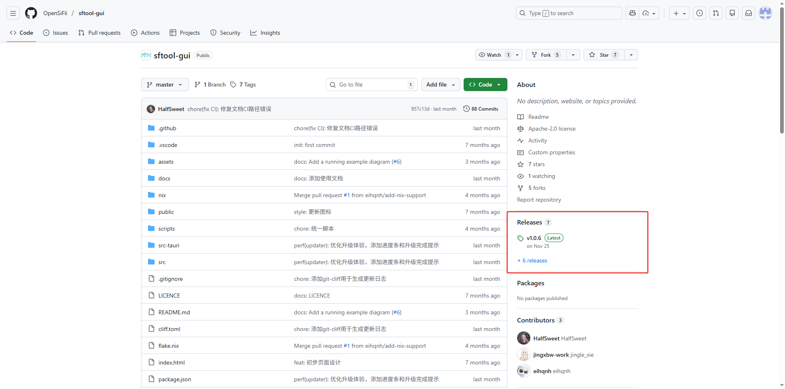
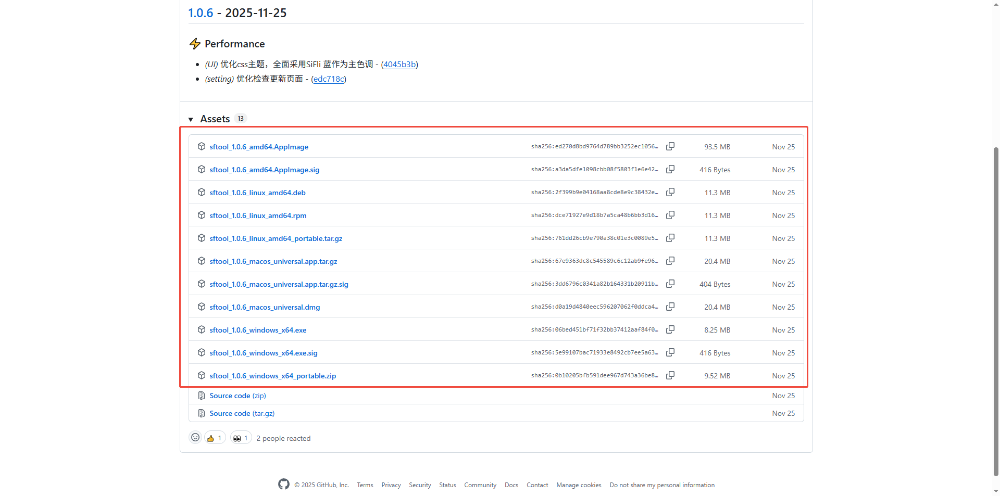
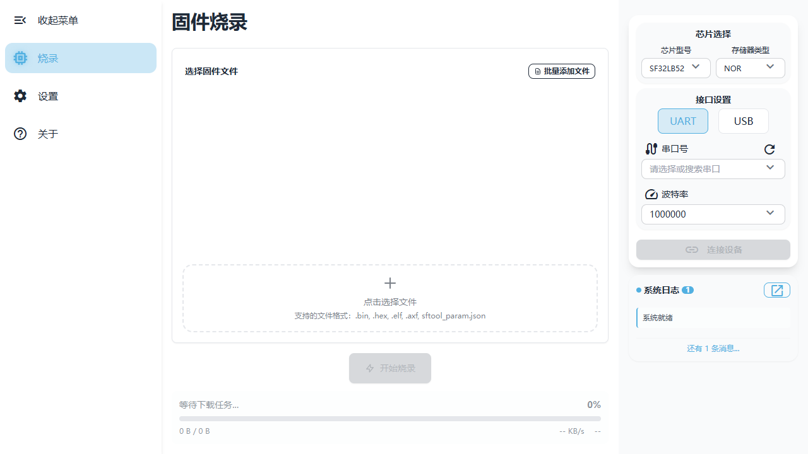
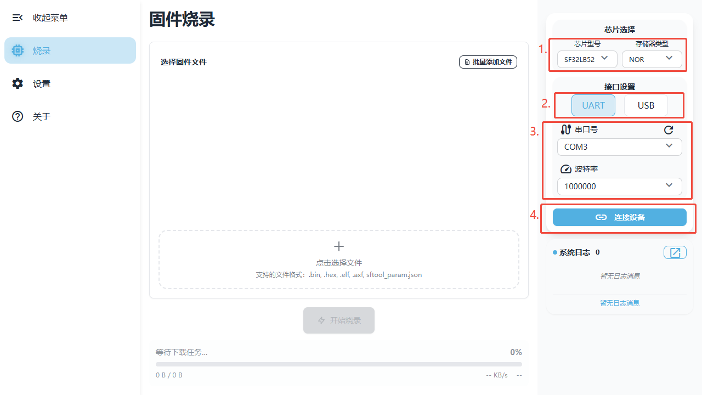
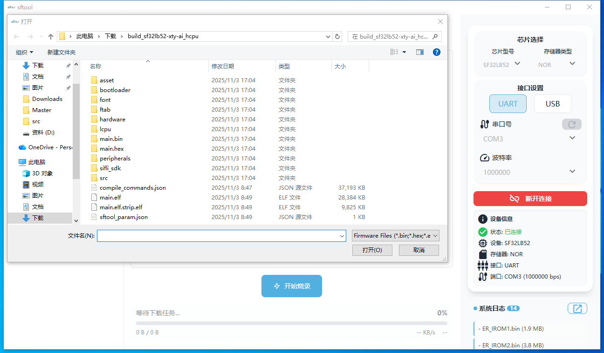
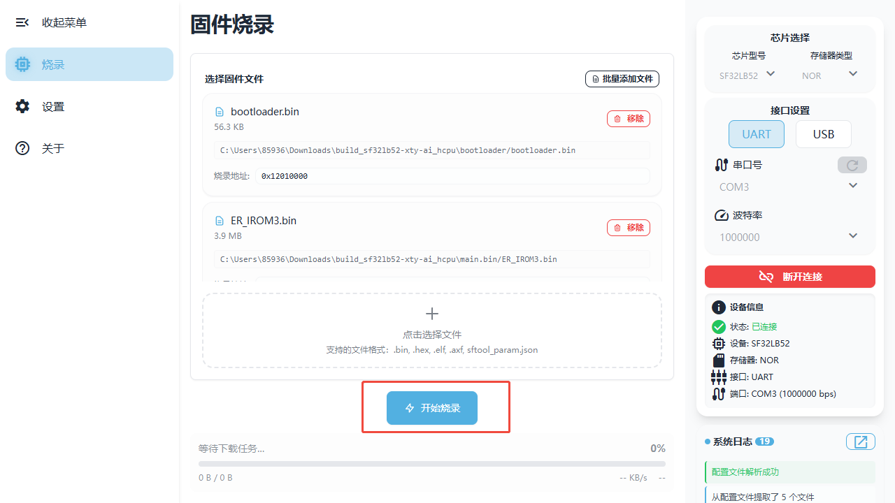
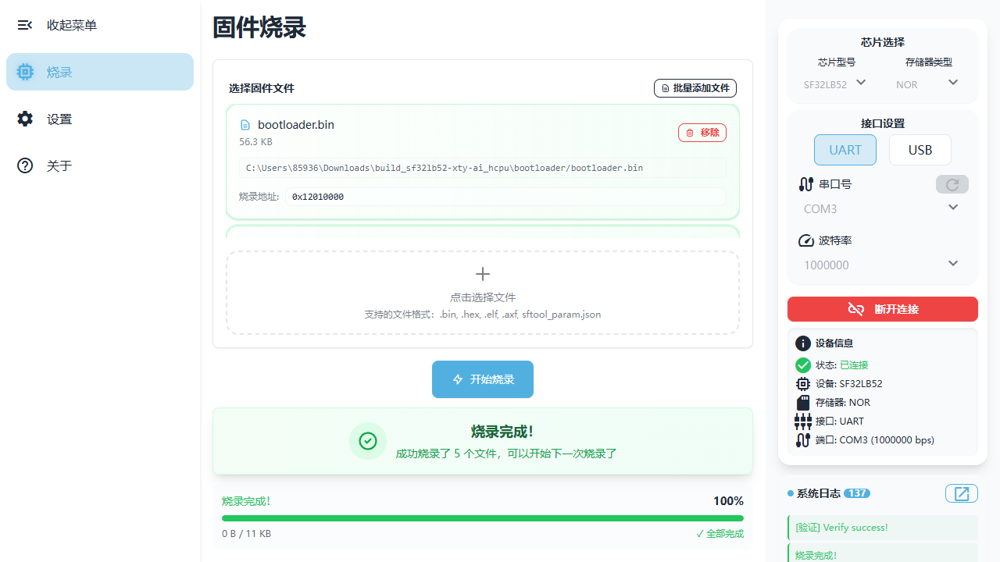

## 一、使用sftool gui下载固件

### 下载并安装sftool gui

1. 访问[sftool gui的GitHub页面](https://github.com/OpenSiFli/sftool-gui)。
2. 在页面的“Releases”部分，找到最新版本的sftool gui。
    
3. 根据你的操作系统（Windows、macOS或Linux）下载相应的安装包。
    
4. 下载完成后，运行安装包并按照提示完成安装。

### 使用sftool gui下载固件

1. 打开已安装的sftool gui应用程序.
    
2. 连接你的设备到电脑，选择芯片型号，存储器类型和烧录使用的接口设置。如果使用uart下载，先搜索串口号，然后选择对应的串口和下载使用的波特率（一般为1000000）。最后点击连接设备。
    
3. 连接成功后，选择你需要下载的固件文件。点击“选择文件”按钮，浏览并选择固件文件。支持的文件格式有：
    - .bin
    - .hex
    - .elf
    - .afx
    - sftool_param.json
    
4. 固件文件选择完成后，点击“开始烧录”按钮，sftool gui将开始下载固件到设备。
    
5. 下载完成后，sftool gui会显示烧录成功的提示。你可以断开设备连接，进行后续操作。
    
## 二、添加新的文件到小智工程

### 构建系统Scons简介

Scons是一个基于Python的开源构建系统，用于自动化软件构建过程。它使用Python脚本作为配置文件，允许开发者定义构建规则、依赖关系和目标文件。Scons的主要特点包括：
- 易于使用：Scons使用Python语言编写，易于学习和使用。
- 自动化依赖管理：Scons能够自动检测文件依赖关系，确保在构建过程中正确处理文件。
- 可扩展性：Scons支持自定义构建规则和工具，适应不同的项目需求。
- 跨平台支持：Scons可以在多个操作系统上运行，包括Windows、Linux和macOS。

### 小智工程Scons构建系统解析

小智工程使用Scons构建系统来自动化管理项目的编译过程。你只需要了解以下几个关键点：

#### 核心文件结构

- **`app/project/SConstruct`**：构建系统的入口文件，负责整体编译流程
- **`app/project/SConscript`**：组织各个模块，指定哪些目录的代码需要编译
- **`app/src/SConscript`**：定义应用源代码的编译规则

#### 构建系统如何工作

Scons构建系统会按照以下流程自动编译项目：

```
SConstruct（入口）
    ↓
SConscript（收集各模块）
    ↓
├─ SDK核心库
├─ app/src（应用源代码）
├─ app/font（字体文件）
├─ app/asset（图片资源）
└─ app/peripherals（外设驱动）
```

编译生成的固件文件会输出到`build_sf32lb52-xty-ai_hcpu`目录下，包括：
- `main.bin`：可下载到设备的二进制固件
- `download.bat`：一键下载脚本

#### 如何添加自己的C文件

**最简单的方法：直接放到src目录**

在`app/src/SConscript`中有这样一行代码：
```python
src = Glob('*.c')
```

这行代码会自动收集`app/src`目录下的所有`.c`文件。所以你只需要：

1. **创建你的C文件**：在`app/src`目录下创建新的`.c`文件，例如`my_function.c`
2. **编写代码**：在文件中编写你的函数
3. **重新编译**：执行编译命令，新文件会自动被加入编译

**示例：**
```bash
# 工程目录结构
app/
  src/
    main.c              # 原有文件
    my_function.c       # 你新添加的文件
    xiaozhi_audio.c     # 原有文件
    ...
```

就这么简单！无需修改任何构建脚本，Scons会自动发现并编译新添加的C文件。

**如果需要添加子目录的文件：**

如果你想在`app/src`下创建子目录来组织代码，需要在`app/src/SConscript`中添加对应的规则：
```python
src = Glob('*.c')
src = src + Glob('./my_module/*.c')  # 添加子目录
```

**添加头文件路径：**

如果需要添加新的头文件搜索路径，在`app/src/SConscript`中修改`CPPPATH`：
```python
CPPPATH = [cwd, cwd + '/my_include']
```

#### 如何添加src以外目录的文件

如果你想在`app`目录下创建一个全新的目录来存放代码（而不是放在src中），需要进行以下步骤：

**步骤1：创建新目录和文件**

例如，创建一个`app/my_driver`目录：
```bash
app/
  my_driver/
    my_sensor.c
    my_sensor.h
```

**步骤2：在新目录中创建SConscript文件**

在`app/my_driver`目录下创建`SConscript`文件，内容如下：
```python
# app/my_driver/SConscript
from building import *

cwd = GetCurrentDir()
src = Glob('*.c')              # 收集所有C文件
CPPPATH = [cwd]                # 添加当前目录到头文件搜索路径

group = DefineGroup('MyDriver', src, depend = [''], CPPPATH = CPPPATH)

Return('group')
```

**步骤3：在项目SConscript中引入新目录**

修改`app/project/SConscript`，添加新目录的编译规则：
```python
# app/project/SConscript
# ... 原有代码 ...

# 添加应用源代码
objs.extend(SConscript(cwd+'/../src/SConscript', variant_dir="src", duplicate=0))

# 添加你的新目录
objs.extend(SConscript(cwd+'/../my_driver/SConscript', variant_dir="my_driver", duplicate=0))

# 字体自动转换
objs.extend(SConscript(cwd+'/../font/SConscript', variant_dir="font", duplicate=0))
# ... 其他模块 ...
```

**步骤4：重新编译**

执行编译命令，新目录中的文件就会被编译到固件中。

**要点说明：**
- `variant_dir`参数指定编译输出目录的名称，通常与源目录名称相同
- `duplicate=0`表示不复制源文件，直接在原位置编译
- `DefineGroup`的第一个参数是组名，可以任意命名
- `CPPPATH`用于添加头文件搜索路径，这样其他文件就可以`#include`你的头文件

### 添加一个内部mcp服务

以添加一个a * b 的mcp服务为例，步骤如下：

**步骤1：创建服务文件**
在`app/src/mcp`目录下创建`mcp_multiply.cc`和`mcp_multiply.h`文件。
    ![image]

**步骤2：编写服务代码**
在`mcp_multiply.cc`中实现服务逻辑：
```c
#include "mcp_server.h"

ReturnValue CalculateSum(const PropertyList& properties) {
    int a = properties["a"].value<int>();
    int b = properties["b"].value<int>();
    return a + b;
}
```

在`mcp_multiply.h`中定义服务接口：
```c
#ifndef MCP_MULTIPLY_H
#define MCP_MULTIPLY_H
#include "mcp_server.h"
ReturnValue CalculateSum(const PropertyList& properties);
#endif // MCP_MULTIPLY_H
```

在`mcp_server.cc`中注册服务：
```c
...
void mcp_server_init(void) {
    ...    
    
    AddTool("self.interrupt.get_status",
        "Get the current status of the interrupt function.",
        PropertyList(),
        [=](const PropertyList&) -> ReturnValue 
        {
            // 注意：vad_enable为1表示不打断，为0表示可打断
            return (bool)(!vad_enable);
        });
#endif   

    AddTool("self.mcp.calculate",
    "Calculate the multiplication of two numbers.",
    PropertyList({
        Property("a", kPropertyTypeInteger, 0, 114514),
        Property("b", kPropertyTypeInteger, 0, 1919810)
    }),
    CalculateSum);
    // Restore the original tools list to the end of the tools list
    tools_.insert(tools_.end(), original_tools.begin(), original_tools.end());
}
```

**步骤3：重新编译**
执行编译命令，新的mcp服务就会被包含在固件中。重新下载固件到设备后，你就可以通过mcp客户端调用这个乘法服务了。这时候你就可以问小智：
```
"114 乘以 514 等于多少？"
```
如果一切顺利，它会返回正确的结果`58596`。

## 三、使用Github Actions自动构建固件

Github Actions是GitHub提供的持续集成和持续部署（CI/CD）服务，可以帮助你自动化构建、测试和部署代码。通过配置工作流文件，你可以在每次代码推送或拉取请求时自动触发构建过程，从而确保代码始终处于可用状态。

具体内容参考：[小智百科全书源码构建](https://docs.sifli.com/projects/xiaozhi/source-build/)
