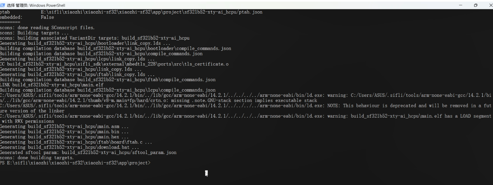
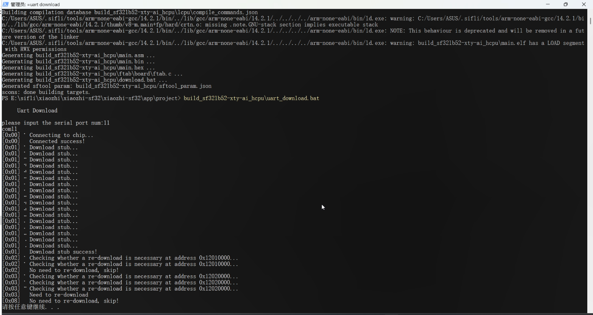
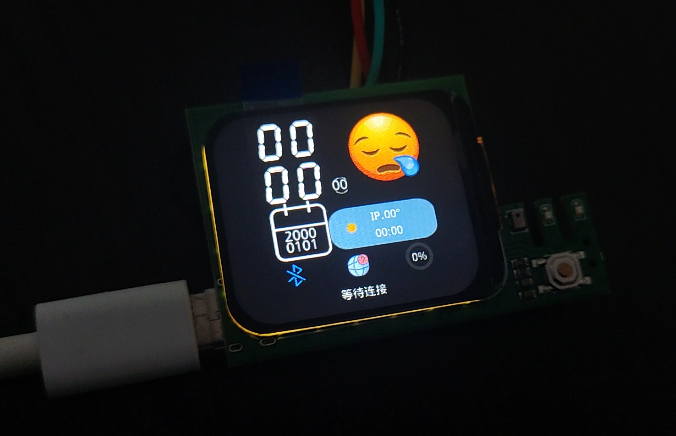

## 一、编译小智工程

### 1. 环境准备

1. **打开 PowerShell** 终端
2. **定位到 SDK 路径**：在小智工程中找到 SDK 目录，执行以下命令激活编译环境：

   ```bash
   .\export.ps1
   ```

### 2. 执行编译

1. **切换工作目录**：进入小智工程的 `app/project` 文件夹，复制其路径
2. **在 PowerShell 中切换目录**：使用 `cd` 命令进入刚才复制的路径
3. **执行编译命令**：运行以下命令开始编译：

   ```bash
   scons --board=sf32lb52-xty-ai --board_search_path="..\boards" -j16
   ```

   **参数说明**：
   - `--board=sf32lb52-xty-ai`：指定目标开发板
   - `--board_search_path="..\boards"`：指定开发板配置文件搜索路径
   - `-j16`：使用 16 个线程并行编译，加快编译速度

### 3. 编译完成确认

- 编译过程**耗时较长**，系统会对图片、动图等资源进行处理，请耐心等待
- 当看到以下输出时，表示编译成功：
  ```
  scons: done building targets
  ```
  


## 二、下载工程到开发板

### 1. 确认端口号

1. 打开 **设备管理器**
2. 在 **端口 (COM 和 LPT)** 下查看开发板对应的端口号（如 COM3、COM4）

### 2. 执行下载

1. 在 PowerShell 终端中输入下载命令：
   ```bash
   build_sf32lb52-xty-ai_hcpu\uart_download.bat
   ```
2. 根据提示输入开发板的**端口号**
3. 等待下载进度完成

### 3. 验证下载结果

1. 下载完成后，终端会显示成功提示
   
2. 开发板将自动重启并运行程序，效果如下：
   
